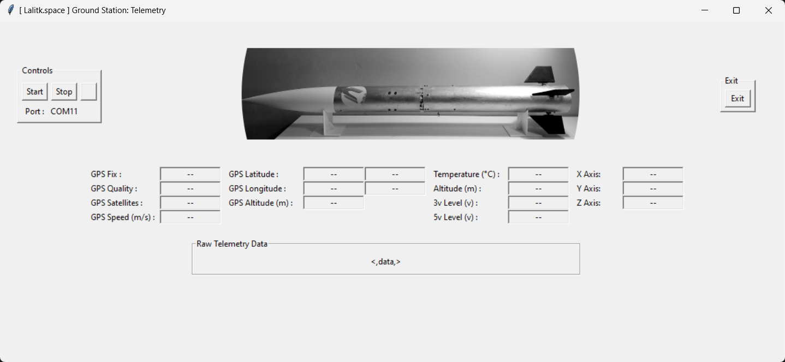

# Ground_Station
 Ground Station (GUI) to receive and visualize live telemetry.

* The project is developed to visualize live telemetry from a Flight Computer that I have developed.
* Two telemetry GUIs are developed, one in MATLAB using the App Designer tool and another one using Python (Tkinter) GUI toolkit.
* An example code is provided for Arduino to behave as a flight data receiver that transmits the received telemetry serially to the Ground Station GUI.  
The primary purpose of the example code is to understand the telemetry format that must be transmitted to the GUI. The GUI will decode the received data and display it. </b>

## Demonstration [MATLAB Based]
  [Ground Station (GUI) Telemetry Demonstration](https://www.youtube.com/watch?v=vqx3Z946B_U) 

# GUI Screenshot [MATLAB]

# GUI Screenshot [Python]

# Description
General description of the telemetry GUIs

Both the GUIs will decode the serial data and display it. MATLAB-based GUI has plotting capabilities and will be implemented in the Python version soon.  

Considering that the serial data format is essential for the GUI to plot and display correct data into respective data fields, an example serial code is provided to understand the serial data format from the Ground Station receiver to the GUI.  

### `GUI is capable of visualizing`
  1. `GPS data` 
      - Whether GPS is fixed or not
      - GPS quality
      - Satellites connected
      - GPS altitude
      - Longitude
      - Latitude
      - GPS speed
  2. `Environmental Data`
      - Temperature
      - Altitude
      - Pressure (disabled)
  3. `Voltage level`
      - 3.3V systems level
      - 5V systems level
  4. `Orientation data`
        - Acceleration in the X, Y, and X axis
  5. `Plots` [currently availabe only in MATLAB version] 
      - Voltages graph 
      - Orientation graph (Acceleration)
      - Altitude graph (both GPS and Barometric)
      - Guage for temperature
      - with high-temperature warning