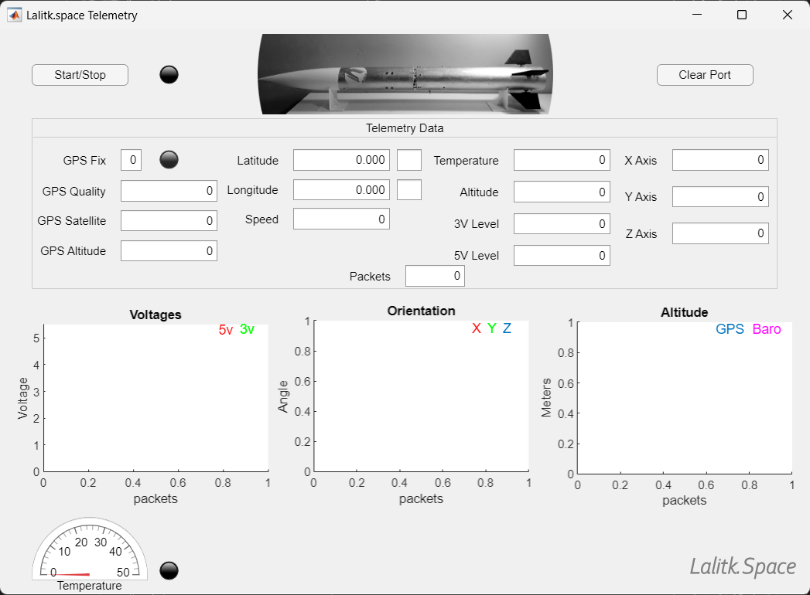

# Ground_Station
 Ground Station (GUI) to receive and visualize live telemetry.

* The project is developed to visualize live telemetry from a Flight Computer that I have developed.
* The telemetry GUI is developed in MATLAB using the App Designer tool.
* An example code is provided for Arduino to behave as a receiver that transmits the received data from the Flight Computer to MATLAB.

## Demonstration 
  [Ground Station (GUI) Telemetry Demonstration](https://www.youtube.com/watch?v=vqx3Z946B_U) 

# GUI Screenshot

# Description
General description of the telemetry GUI

* MATLAB receives the data from the receiver (Arduino-based system) as a string and splits the data into individual flight data.

### `GUI is capable of visualizing`
  1. `GPS data` 
      - Whether GPS is fixed or not
      - GPS quality
      - Satellites connected
      - GPS altitude
      - Longitude
      - Latitude
      - GPS speed
  2. `Environmental Data`
      - Temperature
      - Altitude
      - Pressure (disabled)
  3. `Voltage level`
      - 3.3V systems level
      - 5V systems level
  4. `Orientation data`
        - Acceleration in the X, Y, and X axis
  5. `Plots` 
      - Voltages graph 
      - Orientation graph (Acceleration)
      - Altitude graph (both GPS and Barometric)
      - Guage for temperature
      - with high-temperature warning